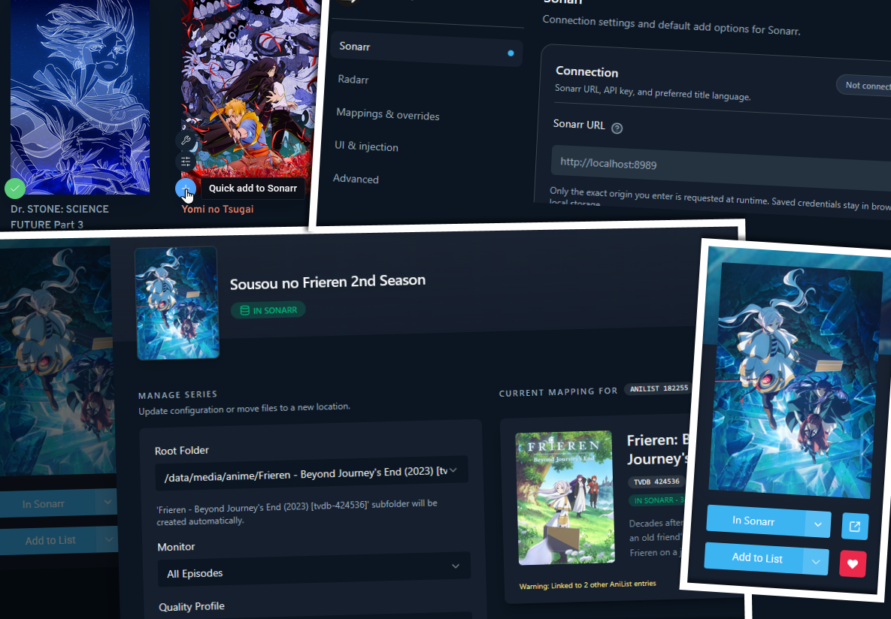
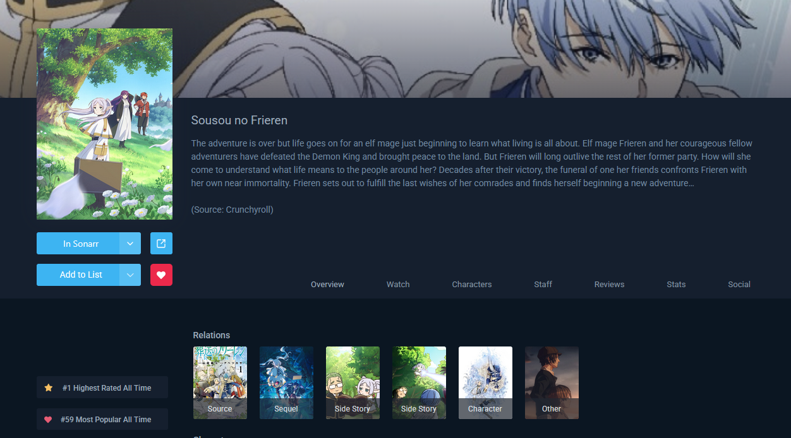
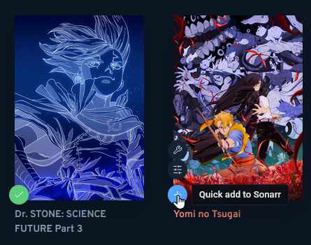
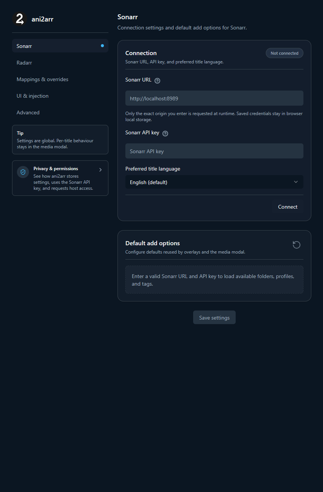

<!-- README overview, install, screenshots, development, and privacy notes for ani2arr. -->
<!-- README.md -->

<p align="center">
  
</p>

<h1 align="center">ani2arr</h1>

<p align="center">
  One-click Sonarr and Radarr actions for AniList and AniChart.
</p>

<p align="center">
  <a href="https://addons.mozilla.org/en-US/firefox/addon/ani2arr/">
    
  </a>
  <a href="https://github.com/infectiousstupidity/ani2arr/releases">
    
  </a>
  <a href="https://github.com/infectiousstupidity/ani2arr/actions/workflows/ci.yml">
    
  </a>
  <a href="LICENSE">
    
  </a>
</p>

<p align="center">
  
</p>

## Features

- Adds Sonarr and Radarr actions to [AniList anime pages](https://anilist.co/anime/21/ONE-PIECE/), [AniList browse](https://anilist.co/search/anime), and [AniChart](https://anichart.net).
- Routes AniList series to Sonarr and AniList movies to Radarr.
- Uses AniList metadata and public [AniBridge mappings](https://github.com/anibridge/anibridge-mappings) to improve matching.
- Supports manual mappings when automatic matching is wrong, missing, or ambiguous.
- Stores settings locally and does not include analytics, advertising, tracking SDKs, or a developer-operated backend.

## Install

| Browser           | Recommended install                                                        | Notes                                             |
| ----------------- | -------------------------------------------------------------------------- | ------------------------------------------------- |
| Firefox           | [Firefox Add-ons](https://addons.mozilla.org/en-US/firefox/addon/ani2arr/) | Requires Firefox 142 or newer.                    |
| Chrome / Chromium | [GitHub Releases](https://github.com/infectiousstupidity/ani2arr/releases) | Download the Chrome MV3 zip and load it unpacked. |

### Manual install

**Firefox XPI**

1. Download the signed XPI from Firefox Add-ons or GitHub Releases.
2. Open `about:addons`.
3. Gear menu -> `Install Add-on From File...`.
4. Select the XPI.

**Chrome / Chromium**

1. Download and extract the Chrome MV3 zip from GitHub Releases.
2. Open `chrome://extensions`.
3. Enable Developer mode.
4. Click `Load unpacked`.
5. Select the extracted extension folder.

Local Chrome builds are created under `.output/chrome-mv3`.

## Screenshots

<p align="center">
  
</p>

<p align="center">
  
</p>

<p align="center">
  
</p>

## Development

This project uses pnpm, WXT, React, TypeScript, Tailwind CSS, and Vitest.

### Requirements

- Node.js 24 or newer
- pnpm 11.5.1 or compatible

### Commands

```powershell
pnpm install

pnpm run dev
pnpm run dev:firefox

pnpm run lint
pnpm run compile
pnpm run test

pnpm run build
pnpm run build:firefox

pnpm run zip
pnpm run zip:firefox
```

Build and zip artifacts are created under `.output/`.

## Privacy and permissions

ani2arr stores configuration locally in browser extension storage, including provider URLs, API keys, default add settings, UI preferences, manual mappings, and cached metadata.

ani2arr may request data from configured Sonarr/Radarr servers, AniList GraphQL, and public AniBridge mapping files hosted on GitHub. It does not send data to a developer-owned backend, include analytics, include advertising, include tracking SDKs, sell user data, or sync settings to a developer service.

Browser permissions cover AniList, AniChart, AniList GraphQL, public AniBridge mapping files, and the Sonarr/Radarr provider URL configured by the user. Host permissions are origin-based, and Firefox cannot isolate permissions by port.

See [PRIVACY.md](PRIVACY.md) for the full privacy policy.

## Notes

- Thanks to [AniBridge](https://github.com/anibridge/anibridge-mappings) and their contributors for maintaining the upstream mapping database.
- This project is not actively maintained. The author is not a formally trained developer; use at your own risk.
- Issues and PRs are welcome.

## License

ani2arr is licensed under the [GNU General Public License v3.0](LICENSE).
