<!-- README overview, install, screenshots, development, and privacy notes for ani2arr. -->
<!-- README.md -->

<p align="center">
  
</p>

<h1 align="center">ani2arr</h1>

<p align="center">
  One-click Sonarr, Radarr, and Seerr actions for AniList and AniChart.
</p>

<p align="center">
  <a href="https://addons.mozilla.org/en-US/firefox/addon/ani2arr/" target="_blank" rel="noopener noreferrer"></a>
	<a href="https://chromewebstore.google.com/detail/ani2arr/eabpmdcepaidljblhlojckmkmnhdlfcc" target="_blank" rel="noopener noreferrer"></a>
  <a href="https://github.com/infectiousstupidity/ani2arr/releases" target="_blank" rel="noopener noreferrer"></a>
	<br>
  <a href="https://github.com/infectiousstupidity/ani2arr/actions/workflows/ci.yml" target="_blank" rel="noopener noreferrer"></a>
  
  <a href="LICENSE"></a>
</p>

## What is ani2arr?

ani2arr is a browser extension that adds Sonarr, Radarr, and Seerr actions directly to AniList and AniChart.

It is built for self-hosted media users who browse anime on AniList or AniChart and want to add or request media without copying titles, IDs, or metadata by hand.

## Features

* Adds Sonarr, Radarr, and Seerr actions to <a href="https://anilist.co/anime/21/ONE-PIECE/" target="_blank" rel="noopener noreferrer">AniList anime pages</a>, <a href="https://anilist.co/search/anime" target="_blank" rel="noopener noreferrer">AniList browse</a>, and <a href="https://anichart.net" target="_blank" rel="noopener noreferrer">AniChart</a>.
* Adds AniList TV entries to Sonarr.
* Adds AniList movie entries to Radarr.
* Adds optional Seerr request actions for request-based workflows.
* Shows Seerr request status such as requested, processing, partially available, or available.
* Supports Seerr target selection when the automatic TMDB target is missing, wrong, or ambiguous.
* Uses AniList metadata and public <a href="https://github.com/anibridge/anibridge-mappings" target="_blank" rel="noopener noreferrer">AniBridge mappings</a> to improve matching.
* Supports manual mappings when automatic Sonarr, Radarr, or Seerr matching is wrong, missing, or ambiguous.
* Stores settings locally in browser extension storage.
* Does not include analytics, advertising, tracking SDKs, or a developer-operated backend.

## Supported providers

| Provider | Purpose                                                                                                  |
| -------- | -------------------------------------------------------------------------------------------------------- |
| Sonarr   | Add and edit TV/anime series through your configured Sonarr server.                                      |
| Radarr   | Add and edit movies through your configured Radarr server.                                               |
| Seerr    | Request media through your configured Seerr instance and let Seerr apply its own Sonarr/Radarr defaults. |

Sonarr and Radarr can be used without Seerr.

Seerr can be used alongside Sonarr/Radarr, or as the main visible action on browse cards.

For Seerr TV requests, ani2arr sends explicit seasons when season data is known. For movies, ani2arr sends the TMDB movie target. Seerr then handles the request according to its own server-side configuration.

## Install

| Browser           | Recommended install                                                                                                                                        | Notes                                  |
| ----------------- | ---------------------------------------------------------------------------------------------------------------------------------------------------------- | ---------------------------------------|
| Firefox           | <a href="https://addons.mozilla.org/en-US/firefox/addon/ani2arr/" target="_blank" rel="noopener noreferrer">Firefox Add-ons</a>                            | Requires Firefox 142 or newer.         |
| Chrome / Chromium | <a href="https://chromewebstore.google.com/detail/ani2arr/eabpmdcepaidljblhlojckmkmnhdlfcc" target="_blank" rel="noopener noreferrer">Chrome Web Store</a> | Requires Chrome/Chromium 120 or newer. |

### Manual install

**Firefox XPI**

1. Download the signed XPI from <a href="https://addons.mozilla.org/en-US/firefox/addon/ani2arr/" target="_blank" rel="noopener noreferrer">Firefox Add-ons</a> or <a href="https://github.com/infectiousstupidity/ani2arr/releases" target="_blank" rel="noopener noreferrer">GitHub Releases</a>.
2. Open `about:addons`.
3. Gear menu -> `Install Add-on From File...`.
4. Select the XPI.

**Chrome / Chromium**

1. Download and extract the Chrome MV3 zip from <a href="https://github.com/infectiousstupidity/ani2arr/releases" target="_blank" rel="noopener noreferrer">GitHub Releases</a>.
2. Open `chrome://extensions`.
3. Enable Developer mode.
4. Click `Load unpacked`.
5. Select the extracted extension folder.

Local Chrome builds are created under `.output/chrome-mv3`.
Release assets on GitHub include SHA256 checksums for manual verification.

## Setup

1. Install ani2arr.
2. Open the extension options.
3. Configure one or more providers:

   * Sonarr
   * Radarr
   * Seerr
4. For Sonarr or Radarr, add the provider URL and API key.
5. For Seerr, enter the server URL and check your existing browser session. If
   needed, use the advanced global API-key mode.
6. Set the default profiles, root folders, monitored state, and add behavior.
7. Open AniList or AniChart.
8. Use the ani2arr actions shown on supported pages.

## Screenshots

| AniList anime page                                                                                                                                                                                                             | AniList browse                                                                                                                                                                          | AniChart browse                                                                                                                                                                             |
| ------------------------------------------------------------------------------------------------------------------------------------------------------------------------------------------------------------------------------ | --------------------------------------------------------------------------------------------------------------------------------------------------------------------------------------- | ------------------------------------------------------------------------------------------------------------------------------------------------------------------------------------------- |
| <a href="docs/images/anilist-anime-page.png" target="_blank" rel="noopener noreferrer">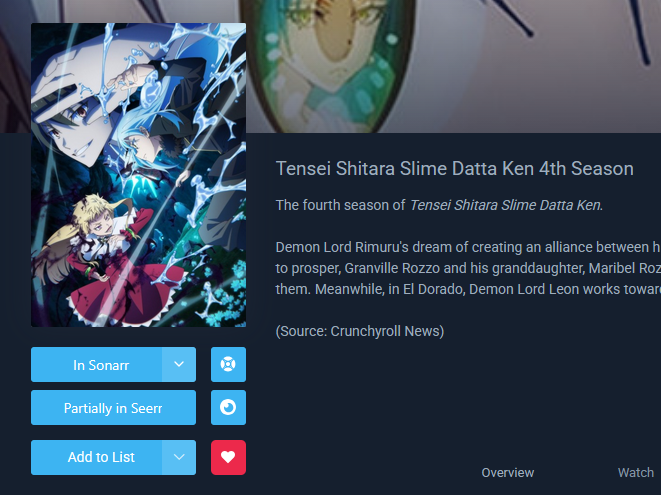</a> | <a href="docs/images/browse-page.png" target="_blank" rel="noopener noreferrer">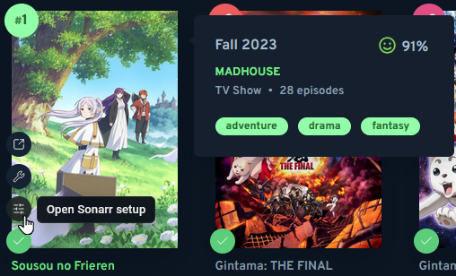</a> | <a href="docs/images/anichart.png" target="_blank" rel="noopener noreferrer">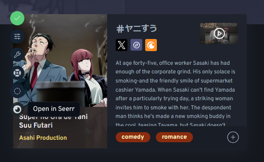</a> |

| Sonarr/Radarr add modal                                                                                                                                                       | Sonarr/Radarr edit modal                                                                                                                                                         | Mapping modal                                                                                                                                                                                                   |
| ----------------------------------------------------------------------------------------------------------------------------------------------------------------------------- | -------------------------------------------------------------------------------------------------------------------------------------------------------------------------------- | --------------------------------------------------------------------------------------------------------------------------------------------------------------------------------------------------------------- |
| <a href="docs/images/modal-add.png" target="_blank" rel="noopener noreferrer">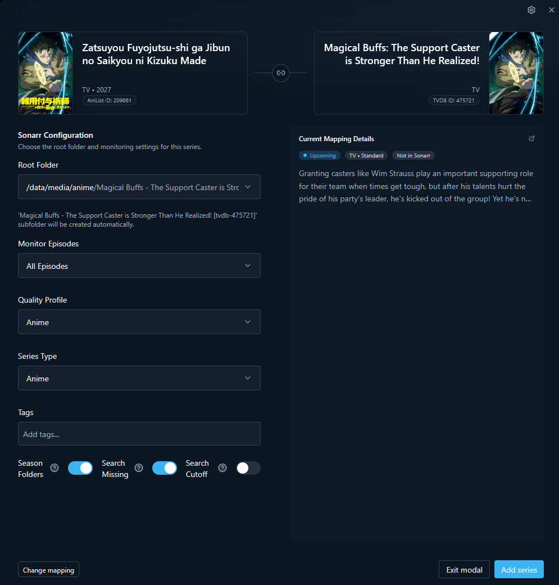</a> | <a href="docs/images/modal-edit.png" target="_blank" rel="noopener noreferrer">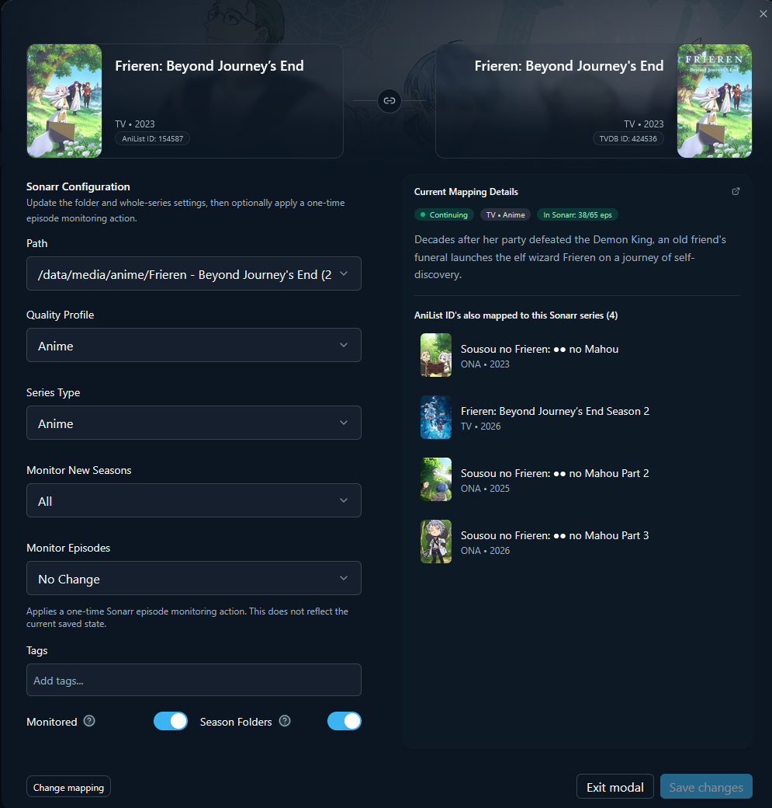</a> | <a href="docs/images/modal-mapping.png" target="_blank" rel="noopener noreferrer">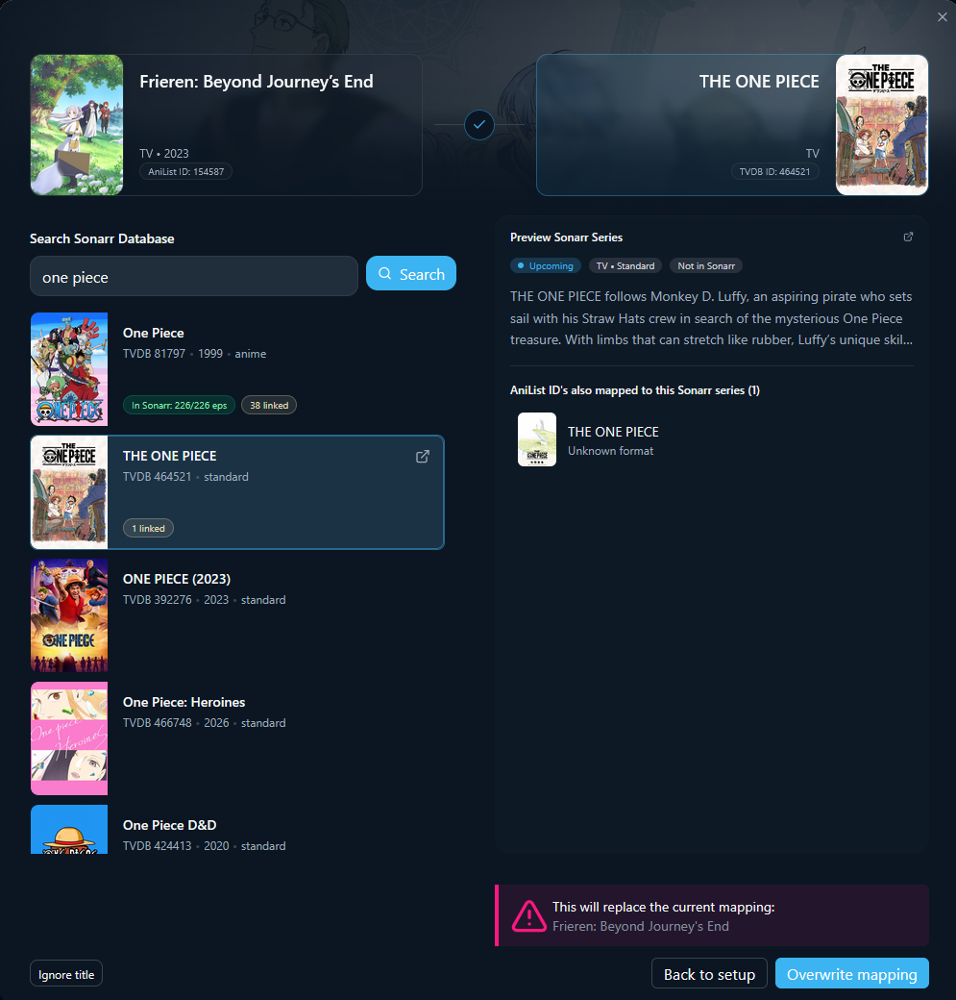</a> |

| Seerr request modal                                                                                                                                                                       | Seerr target picker                                                                                                                                                                                                           |
| ----------------------------------------------------------------------------------------------------------------------------------------------------------------------------------------- | ----------------------------------------------------------------------------------------------------------------------------------------------------------------------------------------------------------------------------- |
| <a href="docs/images/modal-seerr-request.png" target="_blank" rel="noopener noreferrer">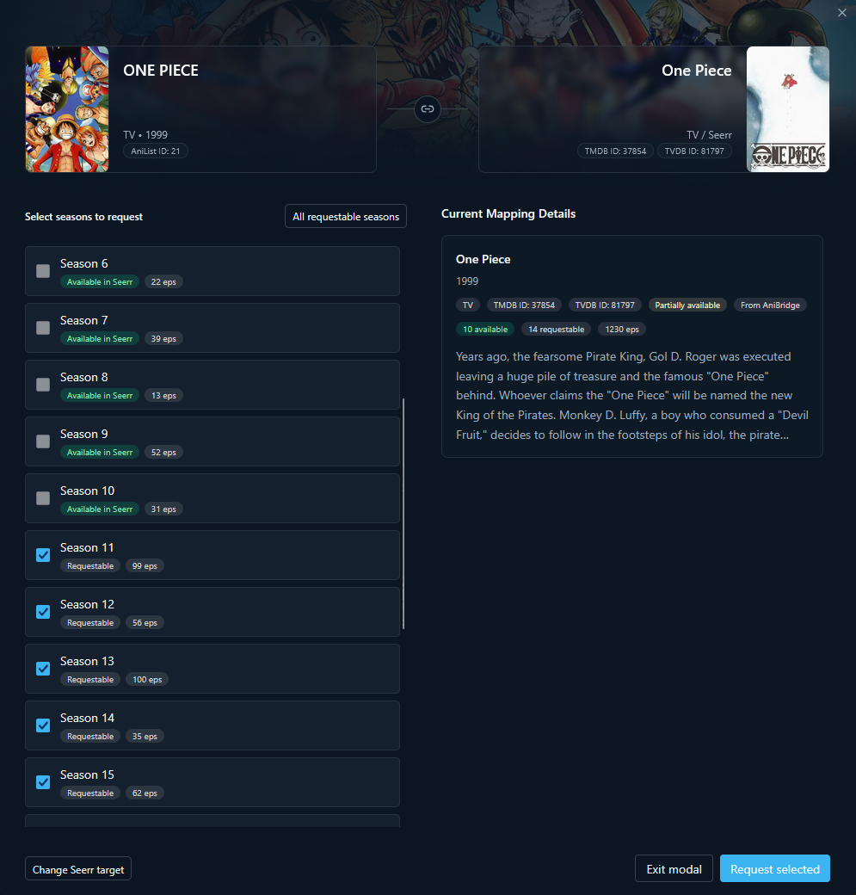</a> | <a href="docs/images/modal-seerr-target.png" target="_blank" rel="noopener noreferrer">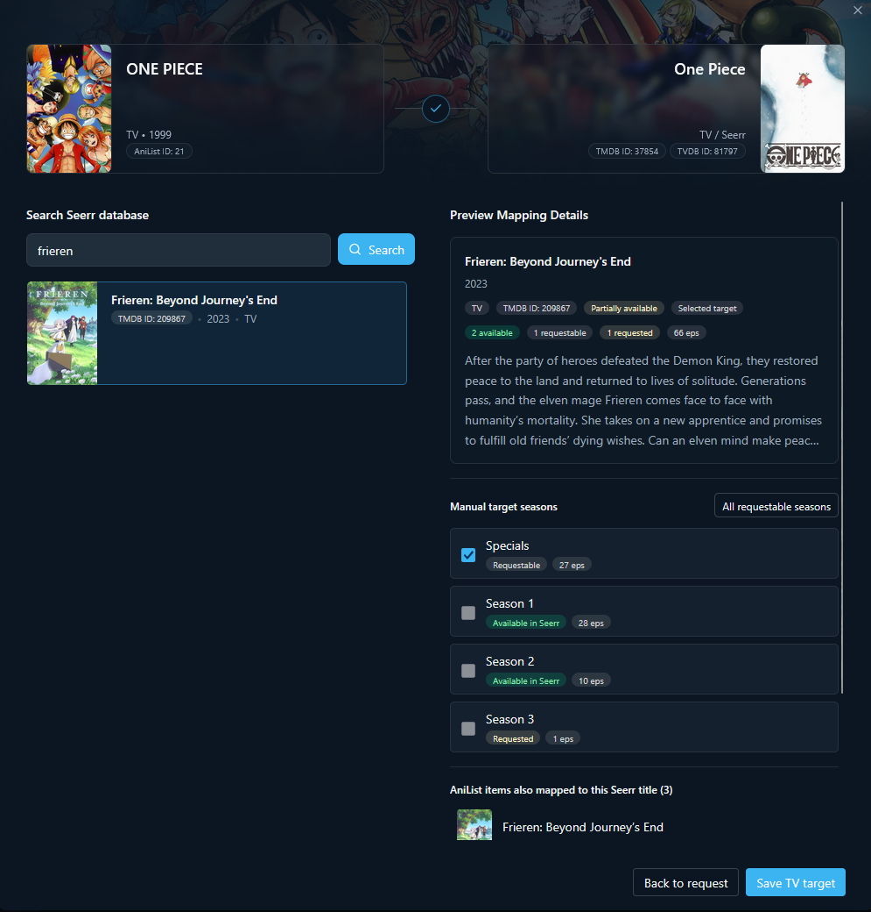</a> |

| Provider options                                                                                                                                                                                               | Mapping options                                                                                                                                                               | UI options                                                                                                                                                     |
| -------------------------------------------------------------------------------------------------------------------------------------------------------------------------------------------------------------- | ----------------------------------------------------------------------------------------------------------------------------------------------------------------------------- | -------------------------------------------------------------------------------------------------------------------------------------------------------------- |
| <a href="docs/images/options-provider.png" target="_blank" rel="noopener noreferrer">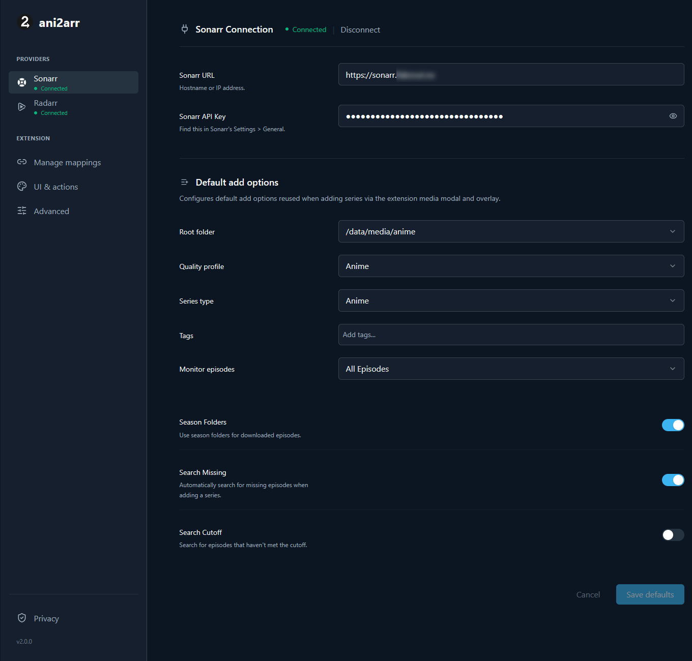</a> | <a href="docs/images/options-mapping.png" target="_blank" rel="noopener noreferrer">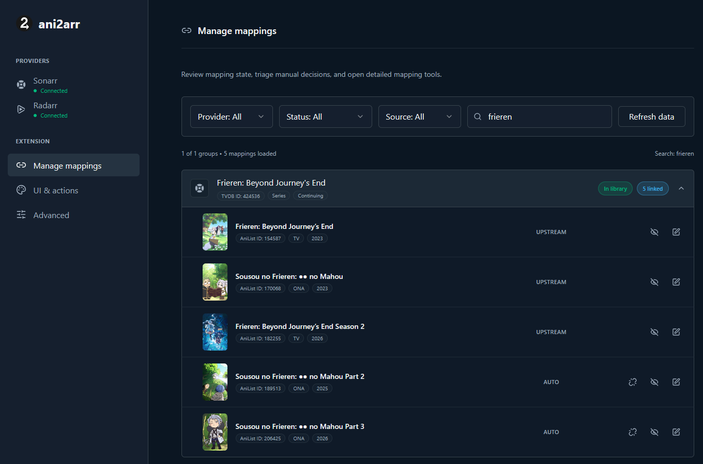</a> | <a href="docs/images/options-ui.png" target="_blank" rel="noopener noreferrer">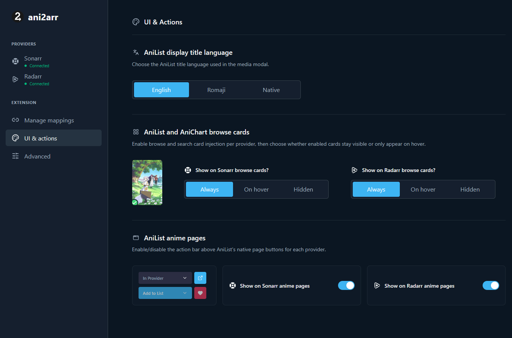</a> |

## ID Matching

ani2arr uses multiple sources to match AniList entries to the correct Sonarr, Radarr, or Seerr target:

* AniList metadata
* AniList media type
* public AniBridge mapping files
* provider search results
* manual mappings saved by the user
* manual Seerr target selections saved by the user

Manual mappings are useful when automatic matching is wrong, missing, or ambiguous.

## FAQ

<details>
<summary><strong>Can ani2arr delete items from Sonarr or Radarr?</strong></summary>

No. ani2arr does not implement delete actions. It can only add new items or edit existing items.

</details>

<details>
<summary><strong>Does ani2arr work with Seerr?</strong></summary>

Yes. ani2arr can request media through a configured Seerr instance and show request status when available.

</details>

<details>
<summary><strong>How does ani2arr sign in to Seerr?</strong></summary>

By default, ani2arr uses the Seerr session already stored by your browser. Enter
the Seerr URL, click **Check Seerr session**, and sign in on Seerr's own page if
prompted. ani2arr does not collect your Seerr, Plex, Jellyfin, or Emby password,
and it does not copy or store the Seerr session cookie.

The global Seerr API key remains available under **Advanced connection**. It is
a privileged server credential and should not be shared with untrusted users.

</details>

<details>
<summary><strong>Why can’t ani2arr use my Seerr browser session?</strong></summary>

Third-party-cookie blocking, Firefox Containers, incognito separation, or other
browser privacy settings can keep an extension background request from using
the same Seerr session. Sign in to the configured Seerr URL in the same browser
profile and try **I have signed in — check again**. If the session remains
unavailable, use the advanced API-key mode when Seerr CSRF protection is
disabled.

Seerr installations with CSRF protection may also reject request creation after
the session check succeeds. ani2arr reports this separately and offers an
explicit **Enable CSRF support** action. Only then does the browser ask for
optional cookie access so ani2arr can read the configured server's readable
`XSRF-TOKEN`; the HTTP-only session cookie is never read. The global API-key
mode remains available for servers without CSRF protection, but it does not
bypass CSRF-protected request creation. If cookie permission is denied, ani2arr
cannot create requests on that server until browser-session CSRF support is
enabled.

</details>

<details>
<summary><strong>Does ani2arr require Seerr?</strong></summary>

No. Sonarr and Radarr can be used directly without Seerr.

</details>

<details>
<summary><strong>Does ani2arr send data to a developer server?</strong></summary>

No. ani2arr does not operate a backend. Settings are stored locally, and requests are made to AniList, AniBridge mapping files, and the providers configured by the user.

</details>

<details>
<summary><strong>Why does Firefox show broad permissions?</strong></summary>

Self-hosted services can run on localhost, private IPs, custom domains, subdomains, or reverse proxies. Browser host permissions are origin-based, so the permission text can look broader than the actual configured use.

</details>

<details>
<summary><strong>Can ani2arr see how many episodes are available in Plex?</strong></summary>

No. ani2arr can show Seerr request status when available, but it does not inspect Plex libraries or count available Plex episodes.

</details>

## Support and issues

Use GitHub Issues to report bugs, mapping problems, and feature requests.

* [Report a bug](https://github.com/infectiousstupidity/ani2arr/issues/new?template=bug_report.yml)
* [Report a mapping issue](https://github.com/infectiousstupidity/ani2arr/issues/new?template=mapping_issue.yml)
* [Request a feature](https://github.com/infectiousstupidity/ani2arr/issues/new?template=feature_request.yml)
* [Open the issue chooser](https://github.com/infectiousstupidity/ani2arr/issues/new/choose)

For security issues, do not open a public issue. See [SECURITY.md](SECURITY.md).

## Privacy and permissions

ani2arr stores configuration locally in browser extension storage, including provider URLs, Sonarr/Radarr API keys, an optional global Seerr API key, Seerr authentication mode, a minimal last-verified Seerr account summary, default add settings, UI preferences, manual mappings, manual Seerr targets, and cached metadata.

In Seerr session mode, the browser manages the session cookie. ani2arr asks the
browser to include applicable cookies when its background process calls the
configured Seerr server, but ani2arr does not read, store, log, or return the
session-cookie value.

ani2arr may request data from:

* configured Sonarr servers
* configured Radarr servers
* configured Seerr servers
* AniList GraphQL
* public AniBridge mapping files hosted on GitHub

ani2arr does not:

* send data to a developer-owned backend
* include analytics
* include advertising
* include tracking SDKs
* sell user data
* sync settings to a developer service

Browser permissions cover AniList, AniChart, AniList GraphQL, public AniBridge mapping files, GitHub release asset URLs used by AniBridge downloads, and the provider URLs configured by the user.

Host permissions are origin-based. Firefox cannot isolate permissions by port, so self-hosted services on localhost, private IPs, subdomains, or reverse proxies may require broader-looking permissions than the actual configured use.

See [PRIVACY.md](PRIVACY.md) for the full privacy policy.

## Development

This project uses pnpm, WXT, React, TypeScript, Tailwind CSS, and Vitest.

### Requirements

* Node.js 24 or newer
* pnpm 11.5.1 or compatible

### Commands

```powershell
pnpm install

pnpm run dev
pnpm run dev:chrome

pnpm run audit
pnpm run lint
pnpm run compile
pnpm run test
pnpm run validate

pnpm run build
pnpm run build:chrome
pnpm run build:all

pnpm run zip
pnpm run zip:chrome
pnpm run zip:all
```

Firefox is the default browser target. Chrome commands use the `:chrome` suffix.
Build and zip artifacts are created under `.output/`.

## Notes

* See [CHANGELOG.md](CHANGELOG.md) for version history.
* See [SECURITY.md](SECURITY.md) for vulnerability reporting.
* Thanks to <a href="https://github.com/anibridge/anibridge-mappings" target="_blank" rel="noopener noreferrer">AniBridge</a> and their contributors for maintaining the upstream mapping database.
* ani2arr is a personal open source project.
* Issues and PRs are welcome, but support and fixes are not guaranteed. See [Support and issues](#support-and-issues).

## License

ani2arr is licensed under the [GNU General Public License v3.0](LICENSE).
